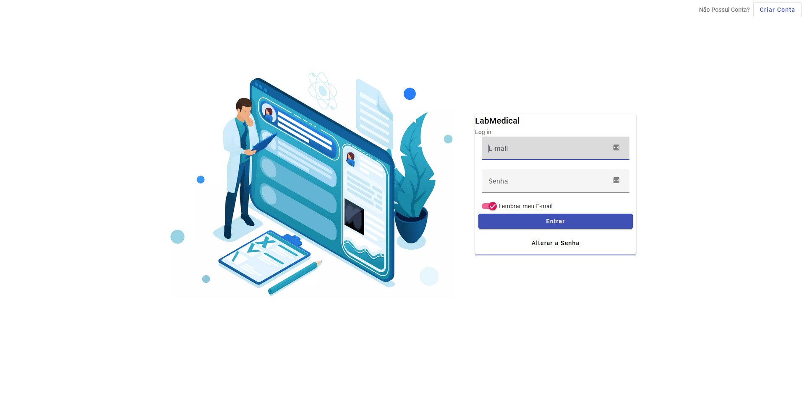

# LABMedical - LABMedicine LTDA




> Tela de Login do Sistema.

### Descrição do Projeto

A LABMedicine LTDA, empresa líder no segmento tecnológico para gestão hospitalar, está com um projeto novo intitulado LABMedical, um software audacioso para gestão de inventário médico. O seu perfil chamou a atenção dos gestores, para criar a aplicação Front-End do software, que deverá ser construída utilizando o framework Angular.

## 💻 Pré-requisitos

Antes de começar, verifique se você atendeu aos seguintes requisitos:

<!---Estes são apenas requisitos de exemplo. Adicionar, duplicar ou remover conforme necessário--->

- Você instalou a versão mais recente de `Angular 15.0.1`

## 🚀 Instalando LABMedical

Para instalar o LABMedical, siga estas etapas:

Por utilizar o Angular 15.0.1 e o Angular Material 14.0.0 tem que forçar a instalação dos pacotes.

```
npm install --force
```

## ☕ Usando LABMedical

Dentro da Pasta assets/db tem o arquivo `db.json`, Banco de dados em Json Server

### Configuração Json Server

```
# Instalação
npm install -g json-server

# Iniciando o servidor
Agora é só rodar o comando abaixo e seu servidor estará iniciado. Lembrando que por padrão a API vai funcionar no enderço: http://localhost:3000

json-server --watch db.json
```

## Exemplo do Arquivo db.json

```
{
  "patient": [],
  "consult": [],
  "exam": [],
  "user": [
    {
      "id": 1,
      "nome": "Rodolfo R Bortolozo",
      "email": "rodolfobortolozo@gmail.com",
      "senha": "123456"
    }
  ]
}
```

### Inicialização do Aplicativo

```
ng serve --o
```
